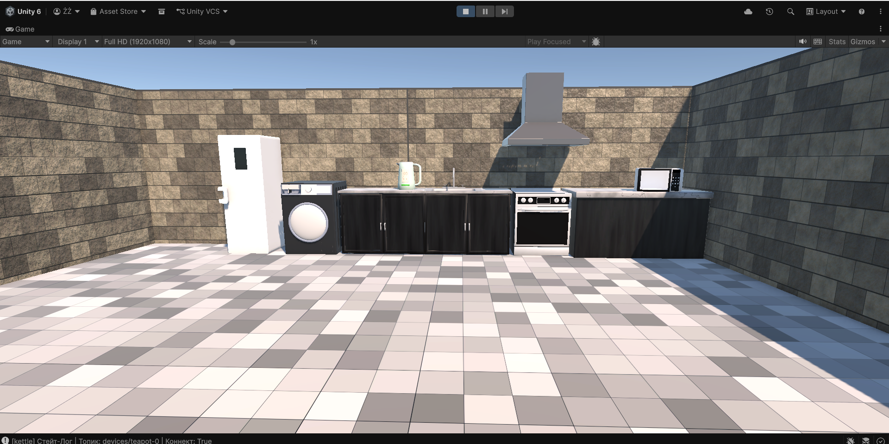
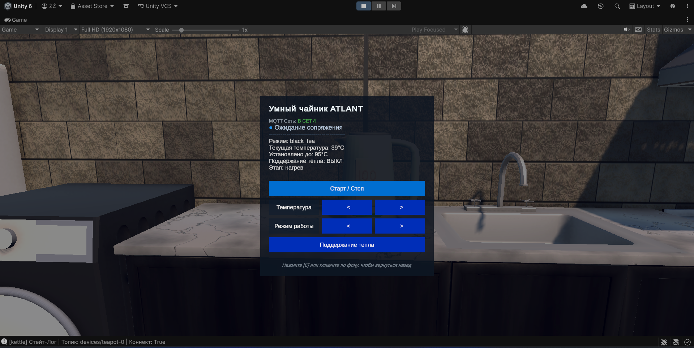
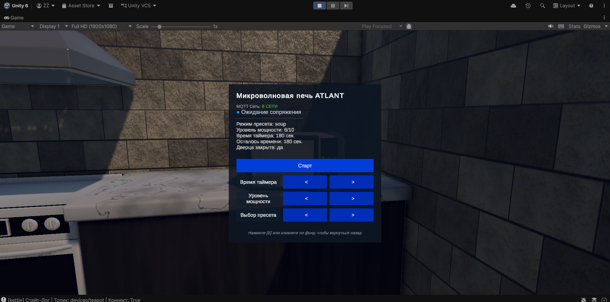
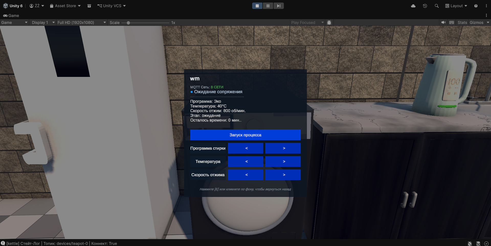
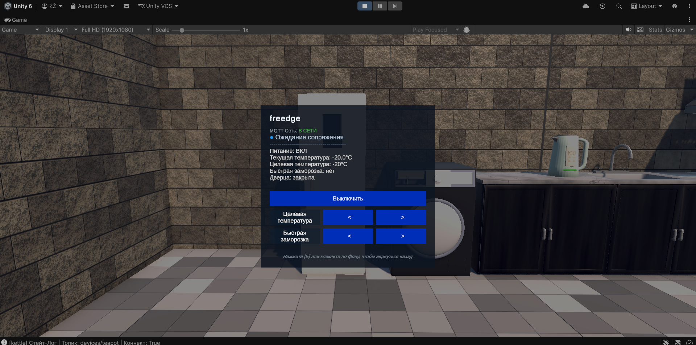
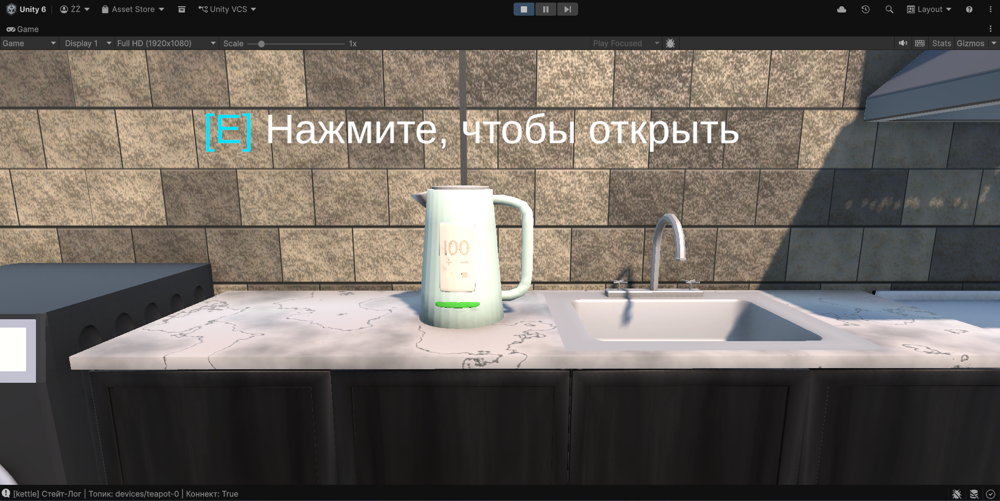
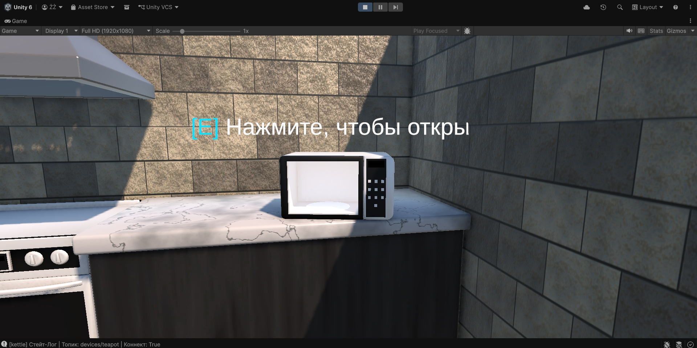
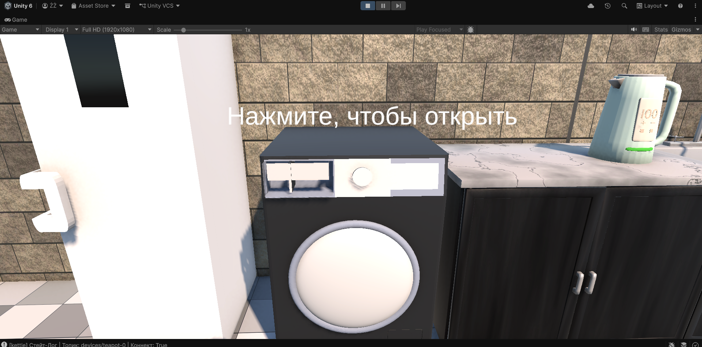
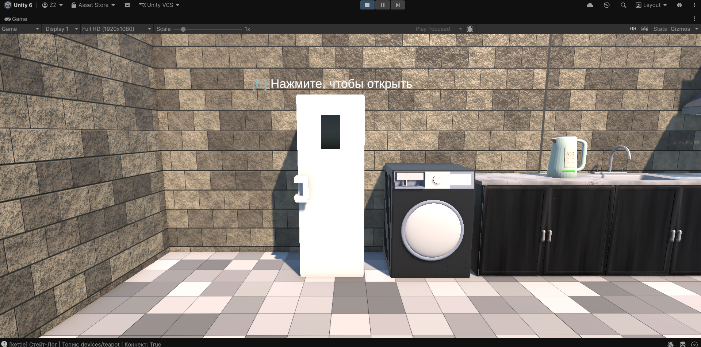

# Atlant Smart Home Demo

Unity-демо MQTT-устройств для умного дома. Проект симулирует несколько бытовых приборов, синхронизирует их состояние через MQTT-брокер и показывает всплывающую подсказку управления прямо в сцене.

## Обзор

Этот проект показывает, как Unity может выступать в роли клиента умного устройства для системы домашней автоматизации.

Сейчас в демо есть:
- Свет
- Кофемашина
- Микроволновка
- Стиральная машина
- Морозильник
- Чайник

Общие возможности:
- Подключение к MQTT и подготовка сессии
- Стабильные топики для каждого устройства и сохранение состояния сопряжения
- Публикация состояния и availability
- Симуляция поведения каждого прибора
- Подсказки и управление прямо в сцене через клавиатуру и клики

## Как это работает

Каждое устройство наследуется от `AtlantMqttDeviceBase`, который отвечает за:
- подключение к брокеру
- формирование топиков
- сценарий сопряжения
- публикацию JSON-состояния
- обработку входящих команд

Классы устройств реализуют собственное состояние, логику симуляции и соответствие команд.

## Управление

Управление зависит от выбранного прибора, но подсказка всегда показывает доступные действия.

Типовые сочетания:
- `F` включает/выключает или запускает/останавливает основное действие
- `1`, `2`, `3` меняют параметры конкретного устройства
- В некоторых сценах доступен клик правой кнопкой мыши по прибору
- `E` закрывает окно подсказки

## Структура проекта

- `Assets/Scripts/AtlantMqttDeviceBase.cs` - общая MQTT-логика и базовый класс устройства
- `Assets/Scripts/AtlantLightDevice.cs` - симуляция света
- `Assets/Scripts/AtlantCoffeeMachineDevice.cs` - симуляция кофемашины
- `Assets/Scripts/AtlantMicrowaveDevice.cs` - симуляция микроволновки
- `Assets/Scripts/AtlantWashingMachineDevice.cs` - симуляция стиральной машины
- `Assets/Scripts/AtlantFreezerDevice.cs` - симуляция морозильника
- `Assets/Scripts/AtlantKettleDevice.cs` - симуляция чайника
- `Assets/Scripts/AtlantDeviceTooltipUI.cs` - подсказка управления в сцене

## Требования

- Проект Unity, открытый в совместимой версии Unity
- MQTT-брокер, доступный по указанным адресу и порту
- Все необходимые пакеты уже должны быть добавлены в проект

## Примечания

- Топики устройств и данные сопряжения могут сохраняться между сессиями, если это включено в инспекторе.
- Подсказка управления рассчитана на работу прямо внутри сцены.
- Некоторые устройства публикуют симулированную телеметрию со временем, поэтому их состояние меняется даже без действий пользователя.

## Скриншоты

  
  
  

  
  
  

  
  
  

